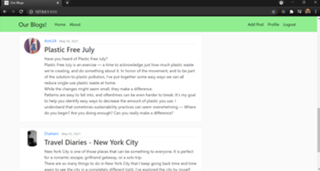
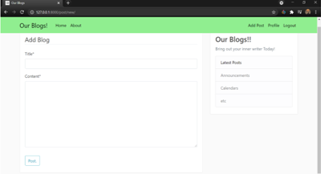

<h1 align="center">:heart: Blogs :heart:</h1>
<div align="center">
  
  <h2> Write and share your experiences here </h2>

</div>

<div align="center">
  
[](https://www.djangoproject.com/ "Django")
[](https://https://www.sqlite.org/ "Sqlite3")

</div>

- ### Snapshots of the project :

<div align="center">
  

  


</div>


---

  
### To run this project :

Clone the project -
```
  $ https://github.com/dhruvdaftary/BlogProject.git
```
  
Install all the requirements -
```
  $ pip install -r requirements.txt
 ``` 
Run the following commands -

 for linux/mac :
``` 
  $ python manage.py makemigrations blog
  $ python manage.py makemigrations users
  $ python manage.py migrate
``` 
 for windows :
 ``` 
  $ python manage.py makemigrations blog
  $ python manage.py makemigrations users
  $ python manage.py migrate
  ``` 
Create Super user for admin page -
``` 
 $ python manage.py createsuperuser
 ```
 
Start the project -
 - ### Run the Web Application -
 for linux/mac :
```
  $ python manage.py runserver
```  
 for windows :
``` 
  $ python manage.py runserver
```
- #### If you have any improvements create an issue and if you want you can also make a pull request for the same 

---


---
<h3 align="center"><b>Developed with :heart: by <a href="https://github.com/dhruvdaftary">Dhruv Daftary</a> and <a href="https://github.com/Tanisha-A">Tanisha Admane</a></b></h1>
